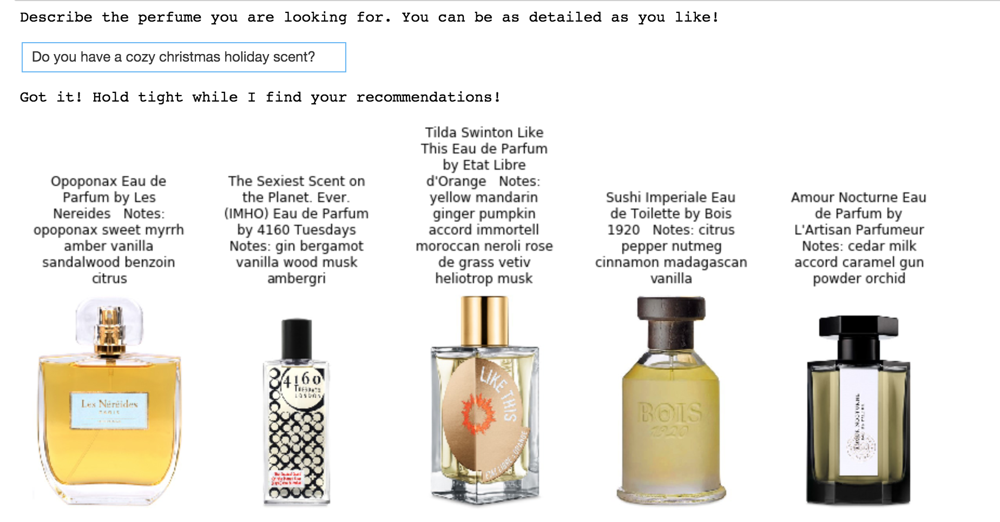
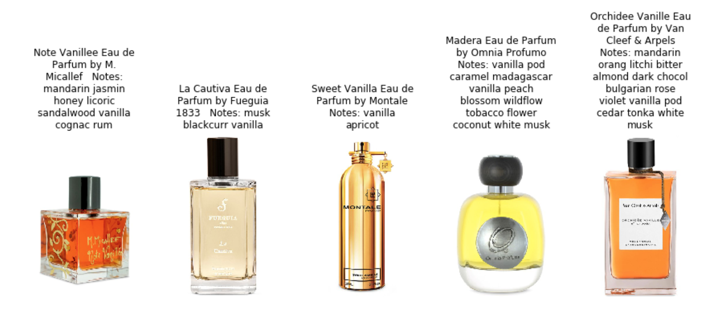
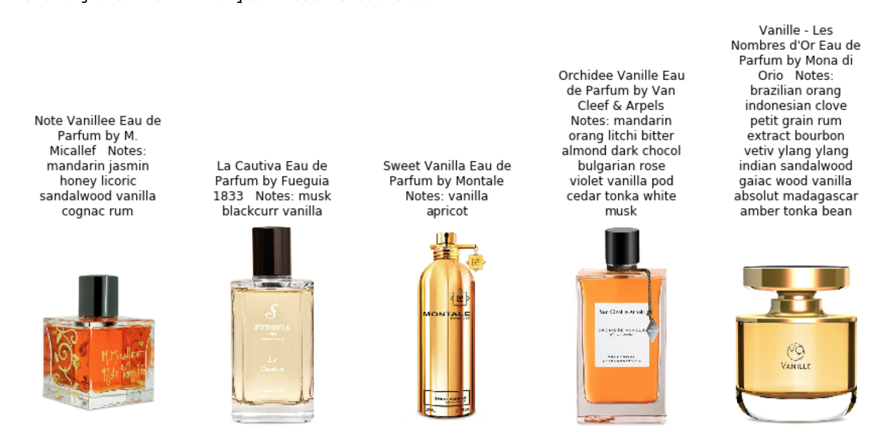

# niche_perfume_recommender

Niche perfumes are defined as rare perfumes created by small, boutique perfume houses. Much like wine, there is a whole subculture that comes with its own detailed and poetic vocabulary used to describe these highly specialized perfumes. As a perfume lover and a data scientist, the unusual and highly descriptive language used in the niche perfume community inspired me to use natural language processing to create a chatbot to help me discover perfumes I might want to purchase myself.

For code to run this chatbot recommender yourself, clone this repo and check out `run_model.ipynb`

# The Chatbot

I created a chatbot that uses Doc2Vec and Latent Semantic Analysis to represent the perfumes in latent space, and information retrieval to recommend perfumes. I set out to overcome a challenge in document retrieval and chatbots. I wanted the recommendations to take into account both my likes <i>and</i> dislikes. If I tell the chatbot "I like roses" I did not want to see the same recommendations if I had said "I hate roses". I needed to take sentiment into account. 

Here is an example interaction with the chatbot. A simple query for a christmas scent returns 5 appropriate perfumes. The first perfume for this request has the very on-topic note of myrrh! The beauty of the language of perfume is you could describe how you want to feel when wearing it, or where you want to wear it, or even your personality or a poem, and the model will be able to return a perfume that will envoke those images. 

# Why is sentiment so important?
Consider this chatbot message. <i>"I like peaches and pears. Boozy vanilla sweet smelling gourmands."</i>

Notice the 4th recommended perfume has notes of coconut and tobacco. What if I hate those notes? I updated my query to include this information, and got an updated list of recommendations. <i>"I like peaches and pears. Boozy vanilla sweet smelling gourmands. I don't like tobacco, or coconut."</i>

# The Model
So how did I do it? 

The first step in the model is to identify the sentiment of each sentence from the chatbot message. I used [VADER](https://github.com/cjhutto/vaderSentiment) to do this. (It was super easy to use, and gave me great results. I highly recommend trying it out if you have a project where you'd like to use sentiment analysis.) I concatenate all positive and neutral sentences into one string, and all negative sentiment sentences into another string. I now have two documents I can use to find similar perfumes.

The perfumes have text descriptions, reviews, and a list of notes. The model consists of two document embeddings, one from LSA and the other from Doc2Vev. To train the LSA and Doc2Vec models, I concatenated perfume descriptions, reviews, and notes into one document per perfume. I then use cosine similarity to find perfumes that are similar to the positive and neutral sentences from the chatbot message query. I remove recommendations of perfumes that are similar to the negative sentences. 

To calculate cosine similarity between the chatbot message perfume documents, I find two similarity scores using both LSA and Doc2Vec. I then averaged the both scores to come up with a new similarity score. 

LSA is a Bag of Words approach, meaning that the context and semantics of the words used are not taken into account. The words used are simple tokenized with TF-IDF, and then compressed with SVD. 

Doc2Vec considers semantics and word order. The context of the document and relationships between words are preserved in the embedding. 

I used both LSA and Dov2Vec embeddings for this project because I wanted to consider the semantics and word orders, but Doc2Vec by itself did not always return the most relevant results. Therefore, it still made sense to match tokenized words directly. For example, a fruity perfume with `apple` notes could have a very similar Doc2Vec vector as a fruity perfume with `peach` notes because the semantics and context of `apples` and `peaches` are very similar in my corpus. The LSA embeddings helps refine the results to surface the peach perfume if you asked for peach notes in the chatbot message.

